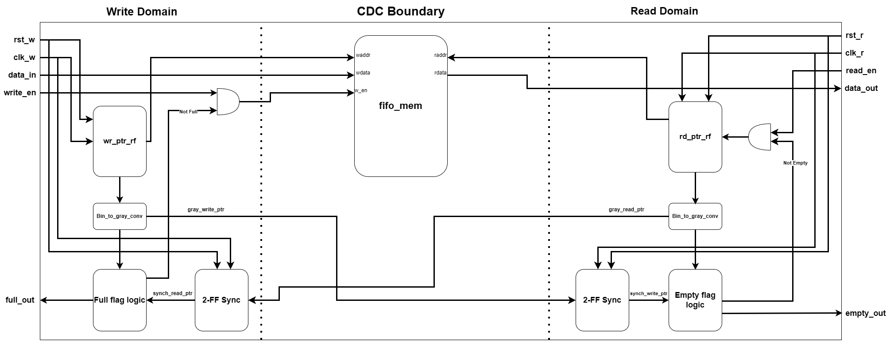

# Dual-Clock Asynchronous FIFO

A parameterizable dual-clock asynchronous FIFO implemented in SystemVerilog for safe data transfer across two independent clock domains using Gray code pointer synchronization and two-flop synchronizer chains.

---

## Architecture

Data written into the FIFO on the write clock domain (`clk_w`) is safely transferred to the read clock domain (`clk_r`) without direct signal crossing. Instead, write and read pointers are converted to Gray code, which changes one bit per increment, and passed through two-flop synchronizer chains before crossing the clock boundary. This eliminates metastability risk and ensures CDC compliance.



### Key Design Decisions

- **Gray code pointers**: only one bit changes per pointer increment, so a multi-bit transition across the clock boundary is never possible
- **Two-flop synchronizers**: each cross-domain pointer passes through two flip-flops clocked by the destination domain, resolving metastability to an industry-standard MTBF
- **Extra pointer bit**: pointers are `ADDR_WIDTH+1` bits wide to disambiguate full vs. empty when both pointers point to the same address
- **Asynchronous memory read**: the read port is combinational, requiring only an address with no clock dependency, avoiding cross-domain timing issues

---

## Parameters

| Parameter | Description | Default |
|---|---|---|
| `DATA_WIDTH` | Bit width of each FIFO entry | 8 |
| `ADDR_WIDTH` | Bit width of the pointer address | 4 |
| `DEPTH` | Number of entries — derived as `2**ADDR_WIDTH` | 16 |

> **Note:** `DEPTH` must be a power of 2. Binary pointers wrap to zero through natural overflow at power-of-2 boundaries, and Gray code only preserves its Hamming distance 1 property, including at wraparound, for sequences of length 2^N.

---

## Project Status

### RTL
- [x] `rtl/bin2gray.sv`: parameterizable binary-to-Gray code converter
- [x] `rtl/fifo_mem.sv`: dual-port memory array (synchronous write, asynchronous read)
- [x] `rtl/wr_ptr_logic.sv`: write pointer register with Gray code output
- [x] `rtl/rd_ptr_logic.sv`: read pointer register with Gray code output
- [x] `rtl/sync_2ff.sv`: two-flop synchronizer for CDC crossing
- [ ] `rtl/async_fifo_top.sv`: top-level integration

### Verification
- [x] `verif/tb_bin2gray.sv`: exhaustive Gray code property testbench
- [ ] `verif/tb_async_fifo.sv`: top-level functional testbench
- [ ] `verif/uvm/`: UVM environment (agent, driver, monitor, scoreboard)

---

## Verification Approach

### Current: Directed Testbench (`tb_bin2gray`)

Exhaustively verifies two Gray code properties across all `2**WIDTH` input values:

1. **Hamming distance 1**: every consecutive Gray code pair differs by exactly one bit
2. **Wraparound property**: Gray(`2**WIDTH - 1`) and Gray(`0`) also differ by exactly one bit

Uses SystemVerilog assertions with `$countones()` for popcount-based Hamming distance checking. Simulation ends with `SUCCESS: ALL TESTS PASSED` only if every assertion passes.

### Planned: UVM Environment

A full UVM testbench is planned for top-level verification, including:
- Constrained-random stimulus via UVM sequences
- Self-checking scoreboard with reference model
- Coverage-driven verification targeting full/empty boundary conditions, simultaneous read/write, and clock ratio stress testing

---

## Simulation

### Requirements

- [Icarus Verilog](http://iverilog.icarus.com/) (with `-g2012` flag for SystemVerilog)
- [GTKWave](http://gtkwave.sourceforge.net/) for waveform viewing

### Run Gray Code Testbench

```bash
iverilog -g2012 -o gray_test verif/tb_bin2gray.sv rtl/bin2gray.sv
vvp gray_test
```

Expected output:
```
VCD info: dumpfile tb_bin2gray.vcd opened for output.
SUCCESS: ALL TESTS PASSED!
```

### View Waveforms

```bash
gtkwave tb_bin2gray.vcd
```

---

## Tools & Environment

| Tool | Purpose |
|---|---|
| Icarus Verilog | RTL simulation |
| GTKWave | Waveform viewing |
| WSL Ubuntu (Windows 11) | Development environment |
| SystemVerilog IEEE 1800-2012 | HDL standard |

---

## Repository Structure

```
async_fifo/
├── rtl/                  # Synthesizable RTL only
│   ├── bin2gray.sv
│   ├── fifo_mem.sv
│   ├── wr_ptr_logic.sv
│   ├── rd_ptr_logic.sv       (planned)
│   ├── sync_2ff.sv           (planned)
│   └── async_fifo_top.sv     (planned)
├── verif/                # Verification — non-synthesizable
│   ├── tb_bin2gray.sv
│   ├── tb_async_fifo.sv      (planned)
│   └── uvm/                  (planned)
├── docs/
│   └── block_diagram.png
├── sim/
│   └── run.sh                (planned)
└── README.md
```

---

## Background

This project is part of an ASIC digital design portfolio targeting roles in RTL design and digital verification. It demonstrates core CDC design discipline including Gray code synchronization, metastability resolution, and parameterizable RTL, skills directly applicable to industry ASIC flows at companies working on high-speed SoC and memory interface design.