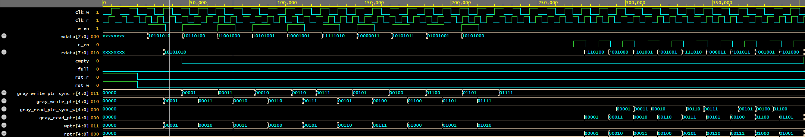

# Dual-Clock Asynchronous FIFO

A parameterizable dual-clock asynchronous FIFO implemented in SystemVerilog for safe data transfer across two independent clock domains using Gray code pointer synchronization and two-flop synchronizer chains.

---

## Architecture

Data written into the FIFO on the write clock domain (`clk_w`) is safely transferred to the read clock domain (`clk_r`) without direct signal crossing. Instead, write and read pointers are converted to Gray code, which changes one bit per increment, and passed through two-flop synchronizer chains before crossing the clock boundary. This eliminates metastability risk and ensures CDC compliance.


(Early version of the top level diagram, some signal names and labels may be missing.)

### Key Design Decisions

- **Gray code pointers**: only one bit changes per pointer increment, so a multi-bit transition across the clock boundary is never possible
- **Two-flop synchronizers**: each cross-domain pointer passes through two flip-flops clocked by the destination domain, resolving metastability to an industry-standard MTBF
- **Extra pointer bit**: pointers are `ADDR_WIDTH+1` bits wide to disambiguate full vs. empty when both pointers point to the same address
- **Gray-domain full/empty comparison**: full and empty flags are derived directly from Gray-coded pointer bit patterns, avoiding the need to decode back to binary
- **Asynchronous memory read**: the read port is combinational, requiring only an address with no clock dependency, avoiding cross-domain timing issues

---

## Parameters

| Parameter | Description | Default |
|---|---|---|
| `DATA_WIDTH` | Bit width of each FIFO entry | 8 |
| `ADDR_WIDTH` | Bit width of the pointer address | 4 |
| `DEPTH` | Number of entries - derived as `2**ADDR_WIDTH` | 16 |

> **Note:** `DEPTH` must be a power of 2. Binary pointers wrap to zero through natural overflow at power-of-2 boundaries, and Gray code only preserves its Hamming distance 1 property, including at wraparound, for sequences of length 2^N.

---

## Project Status

### RTL
- [x] `rtl/bin2gray.sv`: parameterizable binary-to-Gray code converter
- [x] `rtl/fifo_mem.sv`: dual-port memory array (synchronous write, asynchronous read)
- [x] `rtl/wr_ptr_logic.sv`: write pointer register with Gray code output
- [x] `rtl/rd_ptr_logic.sv`: read pointer register with Gray code output
- [x] `rtl/sync_2ff.sv`: two-flop synchronizer for CDC crossing
- [x] `rtl/full_flag_logic.sv`: full flag derived from Gray-coded pointer bit pattern
- [x] `rtl/empty_flag_logic.sv`: empty flag derived from Gray-coded pointer equality
- [x] `rtl/async_fifo_top.sv`: top-level integration

### Verification
- [x] `verif/tb_bin2gray.sv`: exhaustive Gray code property testbench
- [x] `verif/tb_async_fifo_top.sv`: UVM top-level testbench
- [x] `verif/uvm/`: full UVM 1.2 environment (sequencer, driver, monitor, scoreboard, agent, env, test, sequence)

---

## Verification Approach

### Directed Testbench - `tb_bin2gray`

Exhaustively verifies two Gray code properties across all `2**WIDTH` input values:

1. **Hamming distance 1**: every consecutive Gray code pair differs by exactly one bit
2. **Wraparound property**: Gray(`2**WIDTH - 1`) and Gray(`0`) also differ by exactly one bit

Uses SystemVerilog assertions with `$countones()` for popcount-based Hamming distance checking. Simulation ends with `SUCCESS: ALL TESTS PASSED` only if every assertion passes.

### UVM Environment - `verif/uvm/`

A full class-based UVM 1.2 testbench: `fifo_seq_item` (transaction), `fifo_sequencer`, `fifo_driver`, `fifo_monitor`, `fifo_scoreboard` (self-checking reference-model queue), `fifo_agent`, `fifo_env`, `fifo_base_test`, and `fifo_write_read_seq`.

Developed and validated on [EDA Playground](https://www.edaplayground.com) using Synopsys VCS 2025.06 with UVM 1.2, due to known UVM limitations in open-source simulators. Icarus Verilog was used for RTL development and the directed Gray code testbench; VCS was used specifically for the UVM environment, since UVM's constrained-randomization and class infrastructure require a fully SystemVerilog-compliant simulator.

**Test scenario (`fifo_write_read_seq`):** 5 randomized writes followed by 5 reads, fully checked against a software reference queue in the scoreboard.

**Passing output:**

```
UVM_INFO @ 0: reporter [RNTST] Running test fifo_base_test...
UVM_INFO fifo_scoreboard.sv(33) @ 272000: uvm_test_top.env.scoreboard [PASS] Match: expected=170 actual=170
UVM_INFO fifo_scoreboard.sv(33) @ 286000: uvm_test_top.env.scoreboard [PASS] Match: expected=180 actual=180
UVM_INFO fifo_scoreboard.sv(33) @ 300000: uvm_test_top.env.scoreboard [PASS] Match: expected=200 actual=200
UVM_INFO fifo_scoreboard.sv(33) @ 314000: uvm_test_top.env.scoreboard [PASS] Match: expected=169 actual=169
UVM_INFO fifo_scoreboard.sv(33) @ 328000: uvm_test_top.env.scoreboard [PASS] Match: expected=137 actual=137
UVM_INFO /.../uvm_objection.svh(1276) @ 404000: reporter [TEST_DONE] 'run' phase is ready to proceed to the 'extract' phase
--- UVM Report Summary ---
** Report counts by severity
UVM_INFO    :   10
UVM_WARNING :    0
UVM_ERROR   :    0
UVM_FATAL   :    0
```



*Write domain (`clk_w`, `w_en`, `wdata`) and read domain (`clk_r`, `r_en`, `rdata`) operating independently, with `empty`/`full` flags correctly tracking FIFO state across the clock boundary.*

**Engineering note - race condition debugging:** Initial UVM runs produced shuffled, offset data that looked like corruption. Root cause was a chain of race conditions between the DUT's `always_ff` blocks, the UVM driver, and the UVM monitor, all reacting to the same clock edges with no guaranteed execution order between independent processes. Resolved by staggering testbench timing relative to each clock edge (DUT samples at the edge -> driver updates shortly after -> monitor samples after that), confirmed by tracing internal pointer registers (`wptr`, `rptr`) in waveform to isolate the bug to testbench timing rather than the RTL itself.

---

## Simulation

### Requirements

- [Icarus Verilog](http://iverilog.icarus.com/) (with `-g2012` flag for SystemVerilog), RTL and directed testbench
- [GTKWave](http://gtkwave.sourceforge.net/) - waveform viewing
- [EDA Playground](https://www.edaplayground.com) with Synopsys VCS + UVM 1.2 | UVM environment

### Run Gray Code Testbench (Icarus)

```bash
iverilog -g2012 -o gray_test verif/tb_bin2gray.sv rtl/bin2gray.sv
vvp gray_test
gtkwave tb_bin2gray.vcd
```

Expected output:
```
VCD info: dumpfile tb_bin2gray.vcd opened for output.
SUCCESS: ALL TESTS PASSED!
```

### Run RTL Compile Check (Icarus)

```bash
iverilog -g2012 -o fifo_compile_check \
  rtl/async_fifo_top.sv rtl/fifo_mem.sv rtl/wr_ptr_logic.sv \
  rtl/rd_ptr_logic.sv rtl/bin2gray.sv rtl/sync_2ff.sv \
  rtl/full_flag_logic.sv rtl/empty_flag_logic.sv
```

### Run UVM Environment (EDA Playground)

1. Open a new playground at [edaplayground.com](https://www.edaplayground.com)
2. Set Tools & Simulators to **Synopsys VCS**, and UVM/OVM to **UVM 1.2**
3. Add all `rtl/*.sv` files to the Design pane
4. Add all `verif/uvm/*.sv` files plus `verif/tb_async_fifo_top.sv` to the Testbench pane
5. Run

---

## Tools & Environment

| Tool | Purpose |
|---|---|
| Icarus Verilog | RTL simulation, directed testbench |
| GTKWave | Waveform viewing (Icarus flow) |
| Synopsys VCS 2025.06 + UVM 1.2 (via EDA Playground) | UVM environment simulation |
| WSL Ubuntu (Windows 11) | RTL development environment |
| SystemVerilog IEEE 1800-2012 | HDL standard |

---

## Repository Structure

```
async_fifo/
├── rtl/                       # Synthesizable RTL only
│   ├── bin2gray.sv
│   ├── fifo_mem.sv
│   ├── wr_ptr_logic.sv
│   ├── rd_ptr_logic.sv
│   ├── sync_2ff.sv
│   ├── full_flag_logic.sv
│   ├── empty_flag_logic.sv
│   └── async_fifo_top.sv
├── verif/                     # Verification - non-synthesizable
│   ├── tb_bin2gray.sv
│   ├── tb_async_fifo_top.sv
│   └── uvm/
│       ├── fifo_if.sv
│       ├── fifo_seq_item.sv
│       ├── fifo_sequencer.sv
│       ├── fifo_driver.sv
│       ├── fifo_monitor.sv
│       ├── fifo_scoreboard.sv
│       ├── fifo_agent.sv
│       ├── fifo_env.sv
│       ├── fifo_write_read_seq.sv
│       └── fifo_base_test.sv
├── docs/
│   ├── Async_Fifo.png
│   └── waveform.png
└── README.md
```

---

## Background

This project is part of an ASIC digital design portfolio targeting roles in RTL design and digital verification. It demonstrates core CDC design discipline including Gray code synchronization, metastability resolution, parameterizable RTL, and a self-checking UVM verification environment, skills directly applicable to industry ASIC flows at companies working on high-speed SoC and memory interface design.