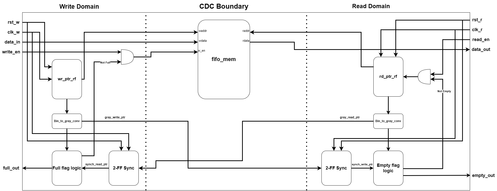

# Dual-Clock Asynchronous FIFO

A parameterizable dual-clock asynchronous FIFO implemented in SystemVerilog for safe data transfer across two independent clock domains using Gray code pointer synchronization and two-flop synchronizer chains. Verified with a self-checking UVM 1.2 environment with functional coverage.

---

## Architecture

Data written on the write clock domain (`clk_w`) is read on the read clock domain (`clk_r`). The data itself never needs a synchronizer: only the read and write pointers cross between domains. Each pointer is converted to Gray code and passed through a two-flop synchronizer clocked by the destination domain. The full flag is computed in the write domain and the empty flag in the read domain, each from the local pointer and the synchronized remote pointer.


(Early version of the top level diagram, some signal names and labels may be missing.)

### Key Design Decisions

- **Gray code pointers**: only one bit changes per increment, so if the destination domain samples a pointer mid-transition, it resolves to either the old or the new value, never an unrelated, corrupted value.
- **Two-flop synchronizers**: a metastable first stage gets a full destination-clock cycle to resolve before the value is used. This does not eliminate metastability; it makes the probability of an unresolved value propagating very low.
- **Conservative flags**: because the remote pointer is seen a few cycles late, `full` may stay asserted slightly after space frees up and `empty` may stay asserted slightly after data arrives. The flags can be pessimistic but never optimistic, so the FIFO never overflows or underflows.
- **Extra pointer bit**: pointers are `ADDR_WIDTH+1` bits wide to distinguish full from empty when both pointers address the same entry.
- **Gray-domain full/empty comparison**: flags are derived directly from Gray-coded pointer bit patterns, without converting back to binary.
- **Combinational read port**: `rdata` reflects `mem[raddr]` without a read-clock register. This is safe because an entry only becomes visible to the reader after the write pointer has crossed the synchronizer, by which time the entry has been stable for several cycles.

---

## Parameters

| Parameter | Description | Default |
|---|---|---|
| `DATA_WIDTH` | Bit width of each FIFO entry | 8 |
| `ADDR_WIDTH` | Bit width of the pointer address | 4 |
| `DEPTH` | Number of entries, derived as `2**ADDR_WIDTH` | 16 |

> **Note:** `DEPTH` must be a power of 2. Binary pointers wrap to zero through natural overflow at power-of-2 boundaries, and the reflected binary Gray code only keeps its single-bit-change property at wraparound for sequences of length 2^N.

---

## Verification Approach

### Directed Testbench: `tb_bin2gray`

Exhaustively verifies two Gray code properties across all `2**WIDTH` input values:

1. **Hamming distance 1**: every consecutive Gray code pair differs by exactly one bit
2. **Wraparound property**: Gray(`2**WIDTH - 1`) and Gray(`0`) also differ by exactly one bit

Uses SystemVerilog assertions with `$countones()` for popcount-based Hamming distance checking.

### UVM Environment: `verif/uvm/`

| Component | Role |
|---|---|
| `fifo_seq_item` | Transaction: `wdata`, `w_en`, `r_en`, plus observed `rdata`, `full`, `empty`. A weighted `dist` constraint selects write-only, read-only, or concurrent read+write. |
| `fifo_write_read_seq` | Phased stimulus (see below). |
| `fifo_driver` | Forks a write thread on `clk_w` and a read thread on `clk_r`, so a single item can drive a write and a read concurrently in both domains. |
| `fifo_monitor` | Two independent threads, one per clock domain, reporting observed writes and reads to the scoreboard. Also contains the functional covergroup. |
| `fifo_scoreboard` | Reference-model queue. Models full/empty behavior: writes while `full` are not pushed and reads while `empty` are not popped. Compares every successful read against expected data. |
| `fifo_agent`, `fifo_env`, `fifo_base_test` | Standard UVM hierarchy; the virtual interface is passed via `uvm_config_db`. |

**Stimulus phases:**

| Phase | Items | Purpose |
|---|---|---|
| 1 | 20 write-only | Fill the FIFO (16) and attempt 4 writes while full |
| 2 | 20 read-only | Drain the FIFO (16) and attempt 4 reads while empty |
| 2b | 20 concurrent read+write | Concurrent traffic starting from empty, which stresses pointer-synchronization latency |
| 3 | 200 randomized (`dist`: 50 write / 25 read / 30 both) | Mixed traffic |
| 4 | 20 read-only | Final drain so end-of-test checks are meaningful |

**Pass criteria** (checked in `report_phase`):
- zero data mismatches
- at least one read was checked
- reference queue empty at end of test (no lost or stuck data)
- write-while-full and read-while-empty were each exercised at least once
- zero `UVM_ERROR` / `UVM_FATAL` in the final report

**Functional coverage:** a covergroup in the monitor, sampled every write-clock cycle after reset:
- `cp_op`: idle / write-only / read-only / both
- `cp_state`: partial / empty / full, with full-and-empty marked as an illegal bin
- `cx_op_state`: cross of operation × state (12 bins)

**Results:**

```
[REPORT] pass=<FILL IN> fail=0 wr_while_full=<FILL IN> rd_while_empty=<FILL IN>
[COV] cp_op=100.0%  cp_state=100.0%  cross=100.0%
UVM_ERROR : 0    UVM_FATAL : 0
```

**Coverage hole found and closed:** the first coverage run reported the cross at 91.7% (11/12 bins). Concurrent read+write while empty was never exercised, because the randomized phase kept the FIFO near full. Adding phase 2b closed the cross to 100%.

**Bug injection:** to confirm the checker can actually detect bugs, `full` was tied to 0 in the RTL. The scoreboard reported 61 data mismatches and 10 entries never read out, and the end-of-test check flagged that write-while-full was never exercised. The RTL was then reverted.

**Race condition debugging:** initial UVM runs produced shuffled, offset data that looked like corruption. The root cause was a race between the DUT's `always_ff` blocks, the UVM driver, and the UVM monitor, all reacting to the same clock edges with no guaranteed execution order. It was resolved by staggering testbench timing relative to each clock edge (driver drives 1 ns after the edge, monitor samples 2 ns after), and confirmed by tracing the internal `wptr`/`rptr` registers in the waveform, which isolated the bug to testbench timing rather than the RTL.

### Known Limitations / Future Work

- **Single agent for two clock domains.** Separate write and read agents with independent sequences would let traffic in each domain run fully independently; currently each item waits for both its threads to finish.
- **`#delay` timing instead of clocking blocks.** Clocking blocks are the standard way to avoid testbench/DUT races.
- **One fixed clock ratio (10 ns / 7 ns).** Randomizing clock periods and phase would exercise more synchronizer timing relationships.
- **No SVA assertions on the RTL.** For example: no write accepted while `full`, no read accepted while `empty`, Gray pointers change by at most one bit per cycle.
- **Small coverage model.** It doesn't include fill-level bins, back-to-back operations, or reset during traffic.
- **No formal or static CDC analysis.** Verification is simulation-only.

---

## Simulation

### Requirements

- [Icarus Verilog](http://iverilog.icarus.com/) (with `-g2012` flag for SystemVerilog): RTL and directed testbench
- [GTKWave](http://gtkwave.sourceforge.net/): waveform viewing
- [EDA Playground](https://www.edaplayground.com) with Synopsys VCS + UVM 1.2: UVM environment

### Run Gray Code Testbench (Icarus)

```bash
iverilog -g2012 -o gray_test verif/tb_bin2gray.sv rtl/bin2gray.sv
vvp gray_test
gtkwave tb_bin2gray.vcd
```

### Run RTL Compile Check (Icarus)

```bash
iverilog -g2012 -o fifo_compile_check \
  rtl/async_fifo_top.sv rtl/fifo_mem.sv rtl/wr_ptr_logic.sv \
  rtl/rd_ptr_logic.sv rtl/bin2gray.sv rtl/sync_2ff.sv \
  rtl/full_flag_logic.sv rtl/empty_flag_logic.sv
```

### Run UVM Environment (EDA Playground)

1. Open a new playground at [edaplayground.com](https://www.edaplayground.com)
2. Set Tools & Simulators to **Synopsys VCS**, and UVM/OVM to **UVM 1.2**
3. Put the RTL in the Design pane. **Only `design.sv` is compiled**, so either paste all `rtl/*.sv` modules into `design.sv` or add the files as tabs and `` `include `` each one from `design.sv`.
4. Put `verif/tb_async_fifo_top.sv` in `testbench.sv` and add the `verif/uvm/*.sv` files as tabs (they are `` `include ``d by the top).
5. Run

---

## Tools & Environment

| Tool | Purpose |
|---|---|
| Icarus Verilog | RTL simulation, directed testbench |
| GTKWave | Waveform viewing (Icarus flow) |
| Synopsys VCS 2025.06 + UVM 1.2 (via EDA Playground) | UVM environment simulation |
| WSL Ubuntu (Windows 11) | RTL development environment |
| SystemVerilog IEEE 1800-2012 | HDL standard |

---

## Repository Structure

```
async_fifo/
├── rtl/                       # Synthesizable RTL only
│   ├── bin2gray.sv
│   ├── fifo_mem.sv
│   ├── wr_ptr_logic.sv
│   ├── rd_ptr_logic.sv
│   ├── sync_2ff.sv
│   ├── full_flag_logic.sv
│   ├── empty_flag_logic.sv
│   └── async_fifo_top.sv
├── verif/                     # Verification, non-synthesizable
│   ├── tb_bin2gray.sv
│   ├── tb_async_fifo_top.sv
│   └── uvm/
│       ├── fifo_if.sv
│       ├── fifo_seq_item.sv
│       ├── fifo_sequencer.sv
│       ├── fifo_driver.sv
│       ├── fifo_monitor.sv
│       ├── fifo_scoreboard.sv
│       ├── fifo_agent.sv
│       ├── fifo_env.sv
│       ├── fifo_write_read_seq.sv
│       └── fifo_base_test.sv
├── docs/
│   ├── Async_Fifo.png
│   └── waveform.png
└── README.md
```

---

## Background

Part of an ASIC digital design portfolio targeting RTL design and design verification roles. Demonstrates Gray code pointer synchronization, two-flop synchronizers, parameterizable RTL, and a self-checking UVM environment with functional coverage.